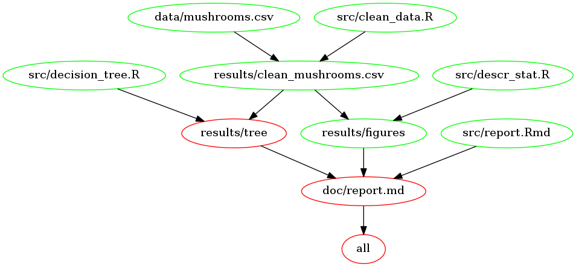

<h1 align="center">
  <br>


Mushrooms Project
<br>
</h1>

<h5 align="center"><a>
Created by Maud Boucherit
</a></h5>

<h4 align="center"><a>
[](https://cran.r-project.org/) 
[](LICENSE.md) 
[](Makefile)
</a></h4>

<h1></h1>

This project's goal is to predict rather a mushroom is poisonous, given some information about the mushroom outlook.

## Overview

During my free time, I enjoy getting lost in the woods. Usually, I can find my way back, but I'm afraid one day I might be lost for good. Identifying non-poisonous mushroom seems like a vital skill. Therefore, can I predict if a mushroom is poisonous based on some of its features?    

I am first looking at the distribution of poisonous mushrooms for each feature. Then I am building a decision tree.   
1. I decided to select only features which humans can easily characterise, like its odour, its shapes, or its colours.   
2. The data is split randomly between training and test sets, with approximately 80% of the data for training.   
3. I am using the R package `rpart` to fit the decision tree on the training set and then create a plot of the selected stumps.   
4. Now, all I need is to follow the decision tree in order to decide whether I can eat a mushroom!

## Dependencies
- `tidyverse`,
- `readr`,
- `rpart` (and `rpart.plot`),
- `rattle`,
- `RColorBrewer`.

## Run this project

To run this project, you have to clone it, then run the Makefile commands on a bash shell:
```bash
git clone https://github.com/MaudBoucherit/mushrooms.git

cd mushrooms/

make clean
make all
```

## Organisation

  

### Data ([data](data/))

Stored [here](data/mushrooms.csv), added on 2017-11-23   

I am using the kaggle's mushrooms dataset (from [here](https://www.kaggle.com/uciml/mushroom-classification)). It contains information about several mushrooms species like their cap's colour, their odor, or if they are poisonous. I want to adjust a decision tree using poisonous or not as my labels, and with the features:   
- cap-shape,  
- cap-color,  
- odor,  
- gill-spacing,  
- gill-size,  
- gill-color,  
- stalk-color,  
- spore-print-color.   

If you want more information about the raw data, please read [data/README.md](data/README.md).

### Scripts ([src](src/))

- Clean the data: [clean_data.R](src/clean_data.R)    
**usage:** `Rscript src/clean_data.R data/mushrooms.csv results/clean_mushrooms.csv`   

- Describe the data: [descr_stat.R](src/descr_stat.R)    
**usage:** `Rscript src/descr_stat.R results/clean_mushrooms.csv`   

- Fit a decision tree on the data: [decision_tree.R](src/decision_tree.R)    
**usage:** `Rscript src/decision_tree.R results/clean_mushrooms.csv results/predictions.csv results/tree.png`   

- Build a report: [report.Rmd](report.Rmd)    
**usage:** `Rscript -e 'ezknitr::ezknit("src/report.Rmd", out_dir = "doc")'`   

If you want more information about these script, please read [src/README.md](src/README.md).

### Report ([doc](doc/))

In this folder, you can find a report summarizing the important results from this project.

### Results ([results](results/))

This folder contains files generated during cleanup and analysis done during the Mushrooms Project. Most of them are displayed in the report.   

If you want more information about these files, please read [results/README.md](results/README.md).
