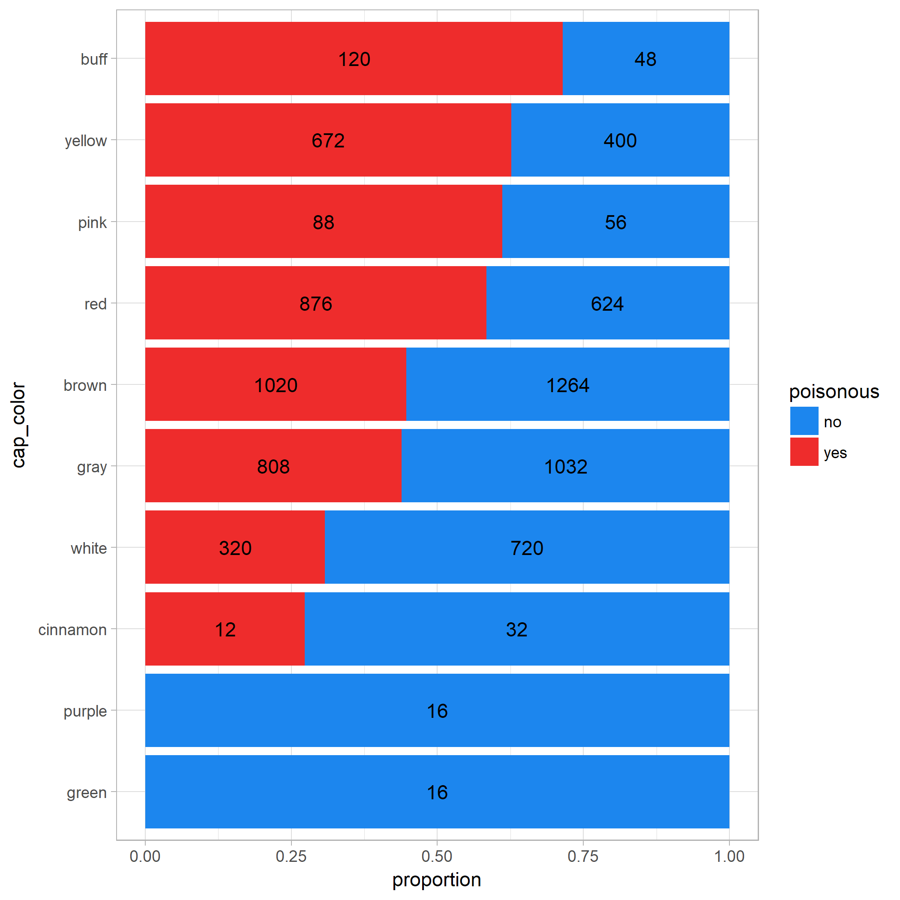
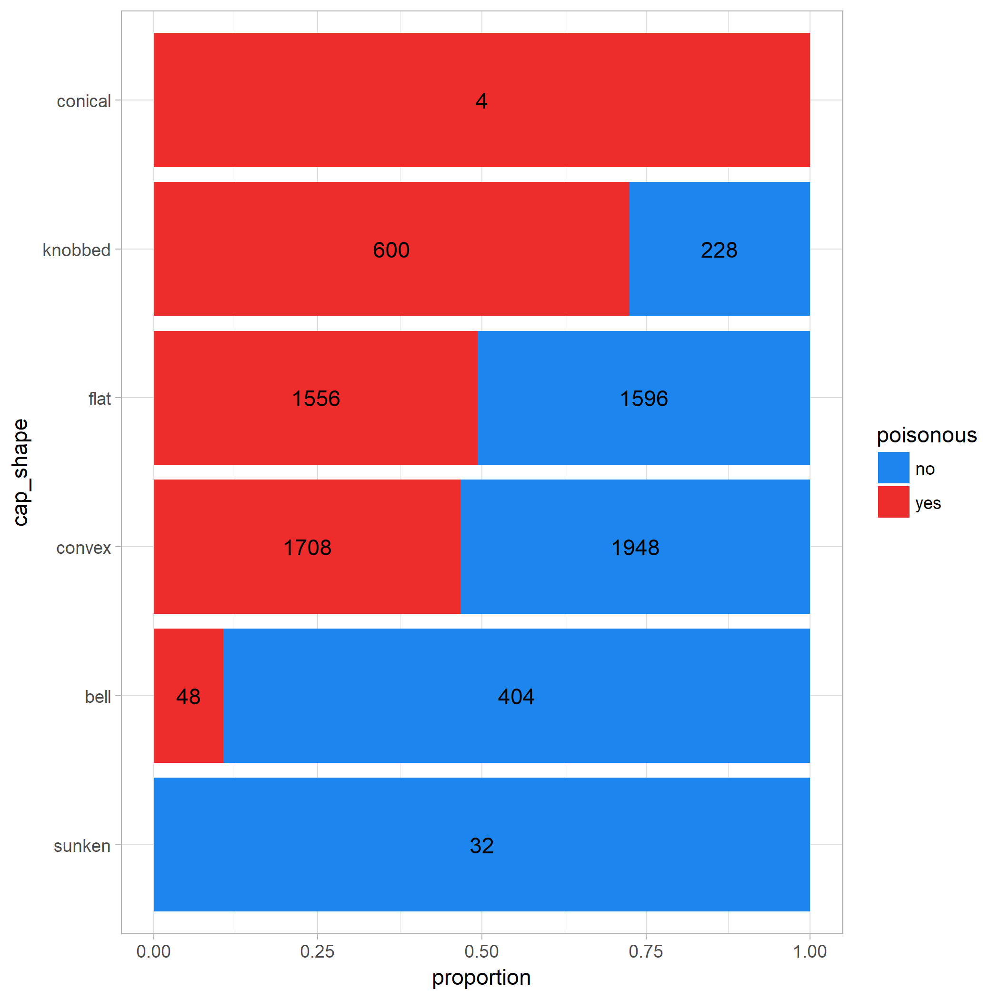
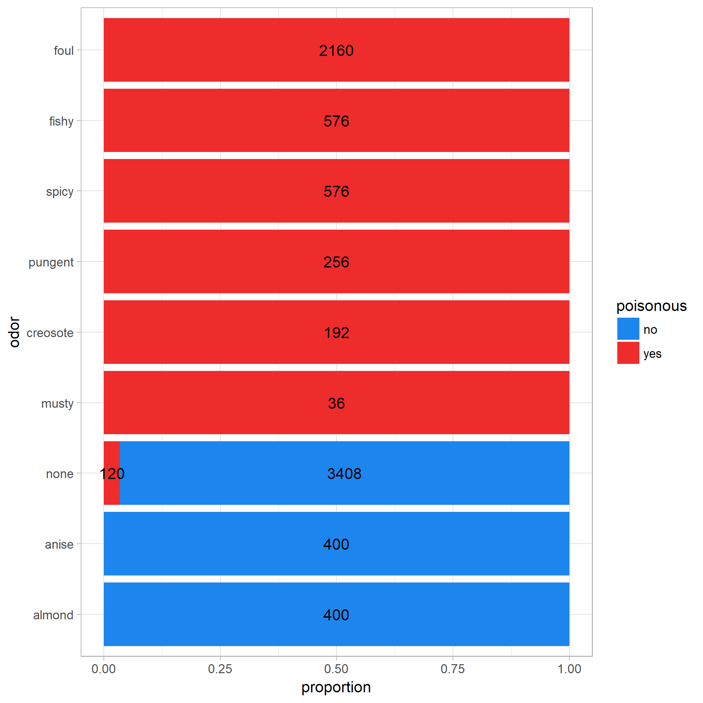
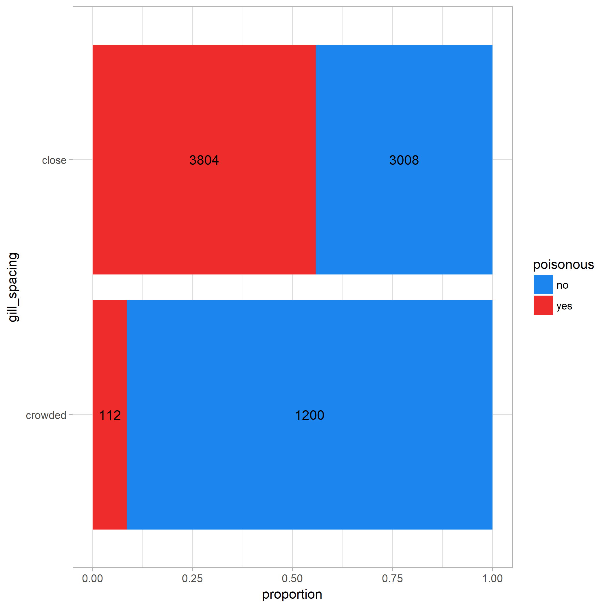
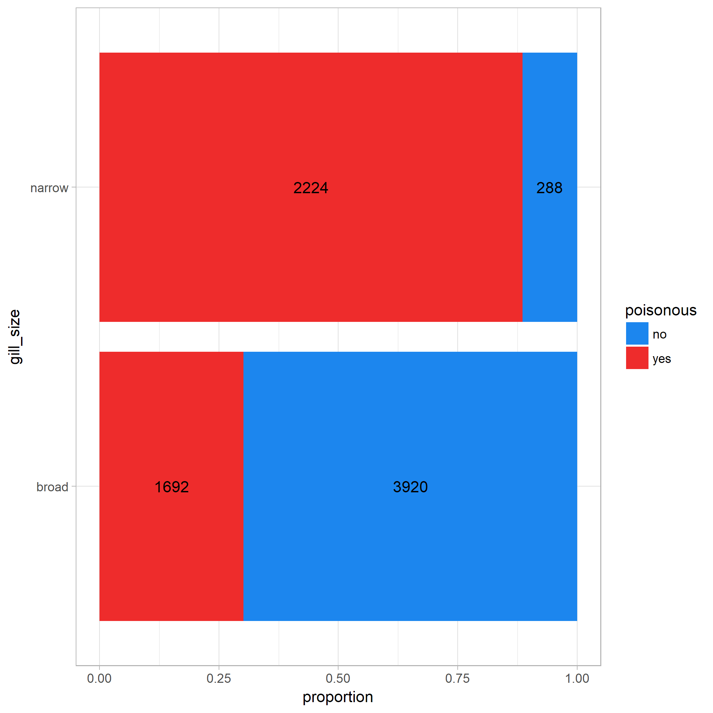
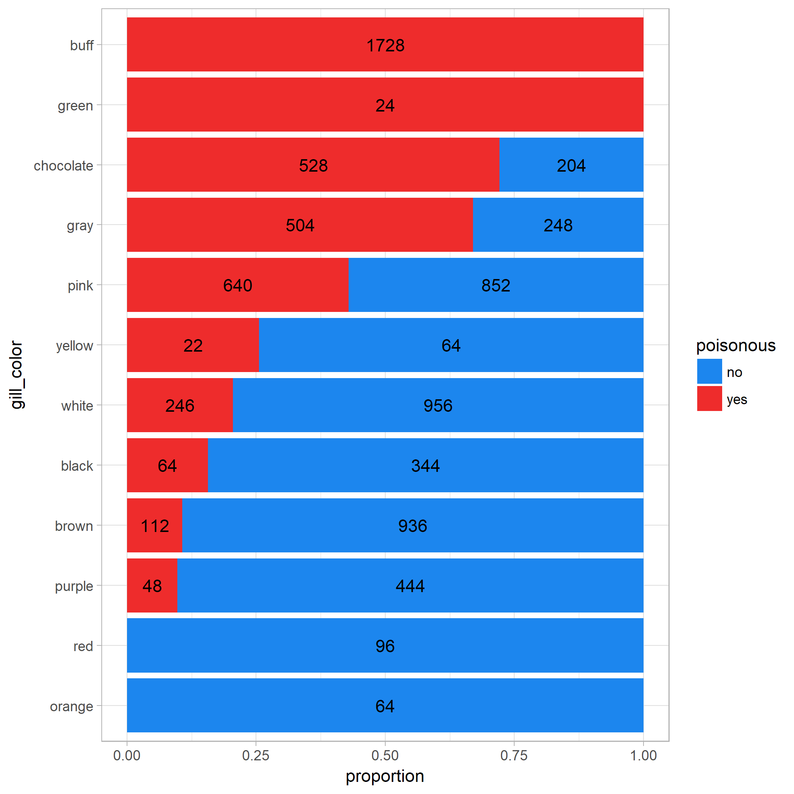
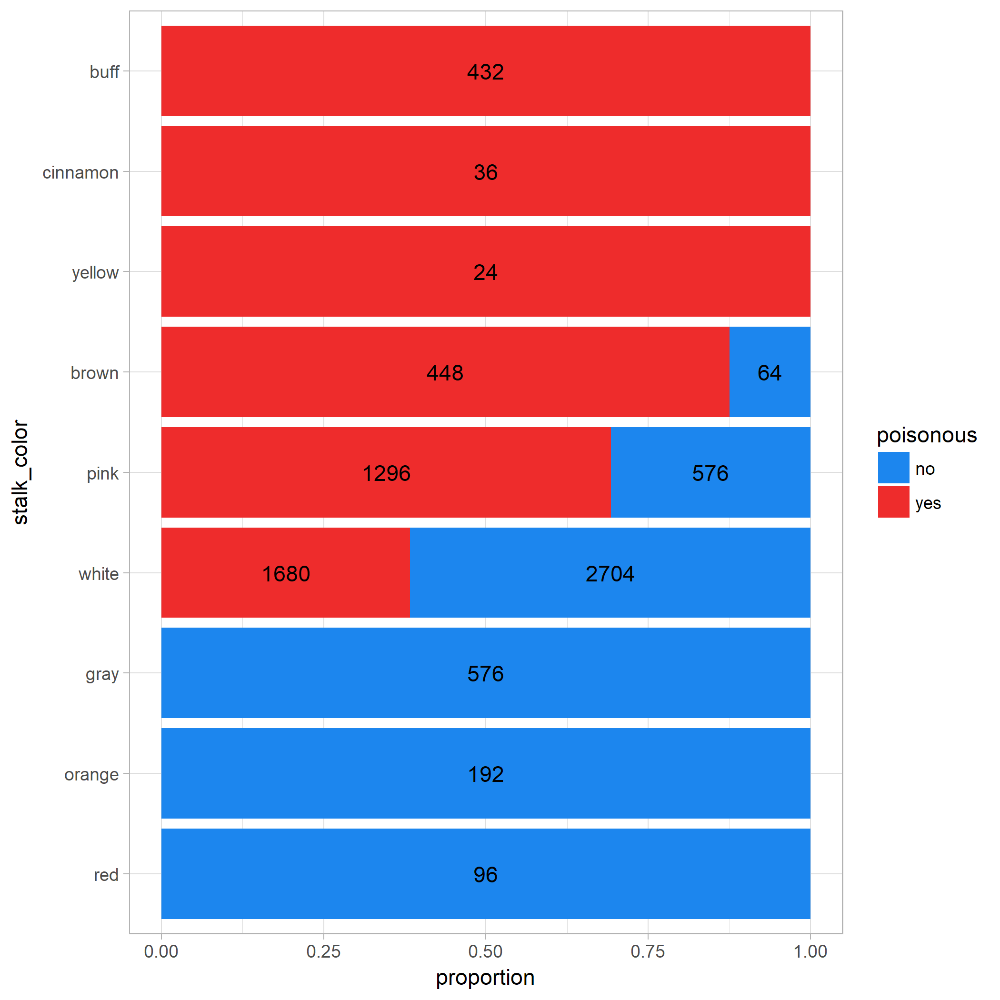
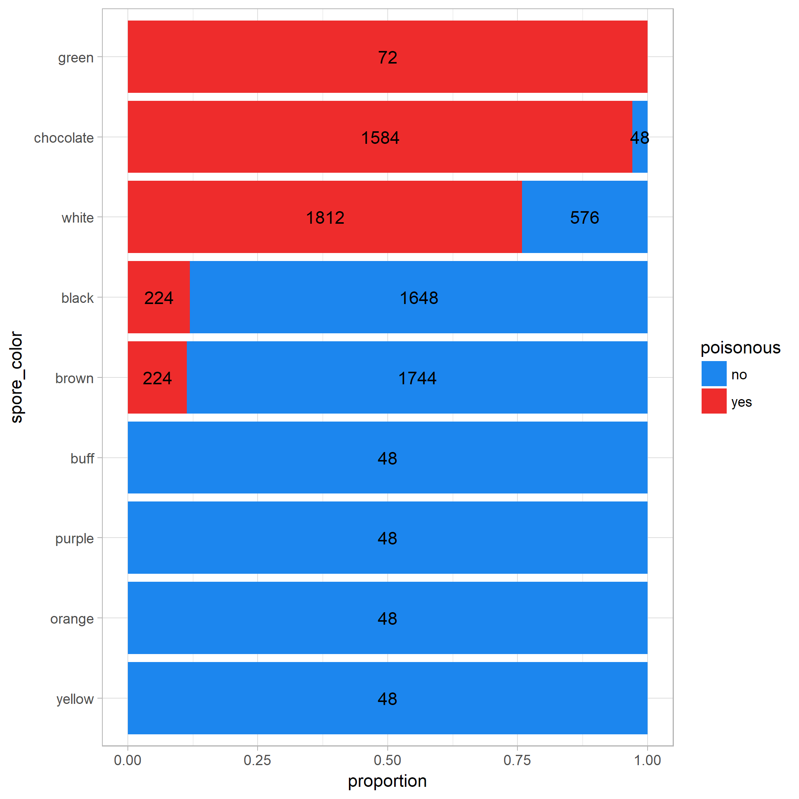
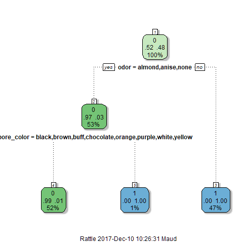

---
output:
  md_document
---


# The mushrooms project

This project's goal is to predict rather a mushroom is poisonous, given some information about the mushroom outlook.

Author: Maud Boucherit   
Released on 2017-11-23   
Last update: 2017-12-09   

During my free time, I enjoy getting lost in the woods. Usually, I can find my way back, but I'm afraid one day I might be lost for good. Identifying non-poisonous mushroom seems like a vital skill. Therefore, can I predict if a mushroom is poisonous based on some of its features?

I will build a decision tree. I want to minimalize the false negative (i.e. minimalize saying a mushroom is not poisonous when it is) so the probability of getting a false negative will be my main score function.


## Data

I am using the kaggle's mushrooms dataset (from [here](https://www.kaggle.com/uciml/mushroom-classification)). It contains information about several mushrooms species like their cap's colour, their odor, or if they are poisonous. I want to adjust a decision tree using poisonous or not as my labels, and with the features:   
- cap_shape,   
- cap_color,   
- odor,   
- gill_spacing,   
- gill_size,   
- gill_color,   
- stalk_color,   
- spore_color.   

## Desrciption

Here are some plot describing the join distribution of the mushroom's class and the explanatory variables.  

#### `cap_color`



#### `cap_shape`



#### `odor`



#### `gill_spacing`



#### `gill_size`



#### `gill_color`



#### `stalk_color`



#### `spore_color`



## Decision tree

I build a decision tree fitting approximately 80% of the data.



This decision tree was then tested with the remaining samples. The predicted values are distributed like this:


```
## # A tibble: 2 x 4
##      X1          count pred.poisonous pred.edible
##   <int>          <chr>          <int>       <int>
## 1     1 real.poisonous            801           0
## 2     2    real.edible              3         877
```
